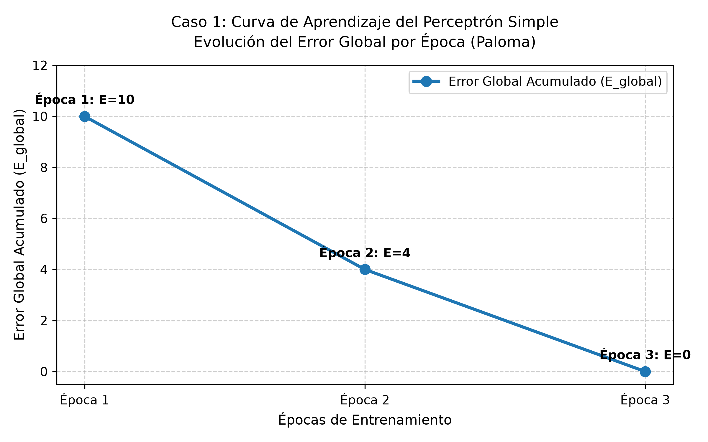
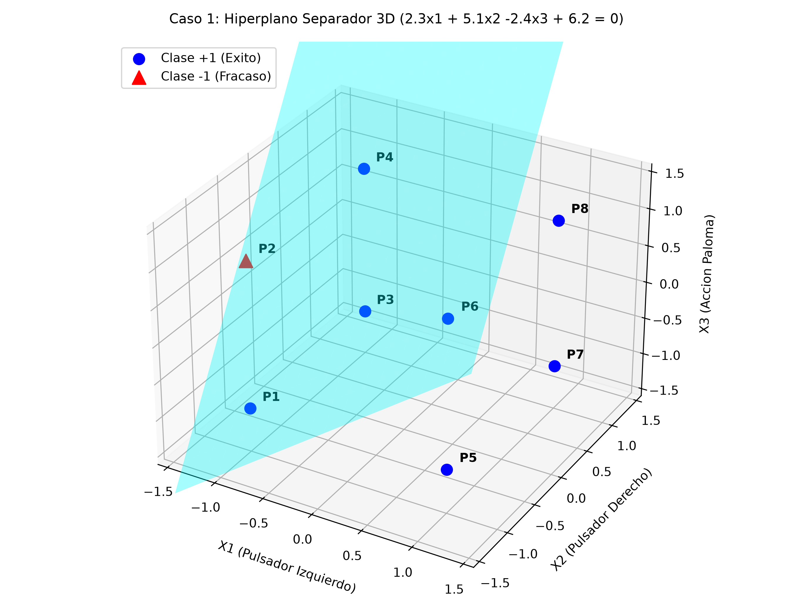

# DESARROLLO DE LA ACTIVIDAD – CASO DE ESTUDIO 1: CONDICIONAMIENTO DE LA PALOMA

---

## Planteamiento del Problema y Variables de Entrada/Salida

### Contexto del Experimento

El presente caso de estudio aborda la simulación de un experimento clásico de **condicionamiento operante o instrumental** en una paloma dentro de una cámara experimental (Caja de Skinner). El dispositivo cuenta con dos pulsadores luminosos adyacentes (uno izquierdo y uno derecho) y un dispensador automático de comida.

La política experimental impone las siguientes condiciones:

1. **Con luces encendidas:** Si al menos uno de los dos pulsadores se encuentra encendido, la paloma recibe alimento picando indistintamente en cualquiera de los dos pulsadores.
2. **Con luces apagadas (ambos pulsadores apagados):** La paloma debe discriminar el entorno y picar estrictamente en el **pulsador derecho** para conseguir la recompensa. Si bajo esta condición pica el pulsador izquierdo, no recibe alimento (fracaso).

El objetivo consiste en entrenar un Perceptrón Simple para que aprenda a discriminar estos estímulos ambientales y emule la toma de decisiones óptima ante cada combinación posible.

---

*(Definición formal del dominio y codificación de variables):*

Las tres entradas y el valor deseado operan estrictamente en el dominio bipolar $\{-1, +1\}$.

* **Codificación de entradas:**
  * $x_1$: Pulsador Izquierdo $\longrightarrow +1$ si encendido; $-1$ si apagado.
  * $x_2$: Pulsador Derecho $\longrightarrow +1$ si encendido; $-1$ si apagado.
  * $x_3$: Acción de la Paloma $\longrightarrow +1$ si pica el izquierdo; $-1$ si pica el derecho.
* **Salida Deseada ($y_d$):**
  * $y_d = +1$: Éxito (la paloma obtiene comida / refuerzo positivo).
  * $y_d = -1$: Fracaso (la paloma no recibe comida).
* **Función de Activación:** Función escalón bipolar `hardlims(a)`:
  $$f(a) = \text{hardlims}(a) = \begin{cases} +1 & \text{si } a \ge 0 \\ -1 & \text{si } a < 0 \end{cases}$$

---

## Tabla de Verdad Bipolar (8 Patrones)

### Justificación y Deducción de los Patrones

Dado que el sistema cuenta con 3 variables independientes de entrada ($x_1, x_2, x_3$) y cada una adopta dos valores posibles ($\pm 1$), existen $2^3 = 8$ combinaciones ambientales y de comportamiento:

* En los patrones $P_3, P_4, P_5, P_6, P_7, P_8$, al menos uno de los pulsadores está encendido ($x_1 = +1$ o $x_2 = +1$), por lo que cualquier acción de la paloma conduce a la recompensa ($y_d = +1$).
* Cuando ambos pulsadores están apagados ($x_1 = -1, x_2 = -1$), si la paloma pica a la derecha ($x_3 = -1$, patrón $P_1$) obtiene comida ($y_d = +1$).
* El único escenario penalizado es el patrón $P_2$, donde ambos pulsadores están apagados y la paloma pica a la izquierda ($x_3 = +1$), resultando en fracaso ($y_d = -1$).

#### Matriz de Patrones de Entrenamiento

| Patrón | $x_1$ | $x_2$ | $x_3$ | Condición Ambiental | Acción Tomada | $y_d$ |
| :---: | :---: | :---: | :---: | :--- | :--- | :---: |
| **$P_1$** | $-1$ | $-1$ | $-1$ | Ambos Apagados | Pica Pulsador Derecho | **$+1$** |
| **$P_2$** | $-1$ | $-1$ | $+1$ | Ambos Apagados | Pica Pulsador Izquierdo | **$-1$** |
| **$P_3$** | $-1$ | $+1$ | $-1$ | Derecho Encendido | Pica Pulsador Derecho | **$+1$** |
| **$P_4$** | $-1$ | $+1$ | $+1$ | Derecho Encendido | Pica Pulsador Izquierdo | **$+1$** |
| **$P_5$** | $+1$ | $-1$ | $-1$ | Izquierdo Encendido | Pica Pulsador Derecho | **$+1$** |
| **$P_6$** | $+1$ | $-1$ | $+1$ | Izquierdo Encendido | Pica Pulsador Izquierdo | **$+1$** |
| **$P_7$** | $+1$ | $+1$ | $-1$ | Ambos Encendidos | Pica Pulsador Derecho | **$+1$** |
| **$P_8$** | $+1$ | $+1$ | $+1$ | Ambos Encendidos | Pica Pulsador Izquierdo | **$+1$** |

---

## Condiciones Iniciales (pesos $W^{(0)}$ y sesgo $b^{(0)}$)

### Origen y Justificación de los Valores

De acuerdo con la metodología algorítmica vista en clase (pseudocódigo del Perceptrón Simple), el modelo debe iniciar en un estado de *tabula rasa* (sin conocimiento previo). Por consiguiente:

1. Los **pesos sinápticos iniciales** se generan de forma pseudoaleatoria con magnitudes pequeñas en el intervalo simétrico $[-1,\ 1]$, garantizando que la red comience explorando el espacio sin simetrías rígidas:
   $$W_1^{(0)}, W_2^{(0)}, W_3^{(0)} \in [-1,\ 1]$$
2. El **sesgo inicial (*bias*)** se establece aleatoriamente dentro del rango positivo $[0,\ 1]$, representando un nivel basal de activación:
   $$b^{(0)} \in [0,\ 1]$$

Aplicando esta condición de inicialización aleatoria, se definen los parámetros de partida del sistema:

$$\mathbf{W}^{(0)} = [0.3,\ -0.9,\ -0.4]^T \qquad b^{(0)} = 0.2$$

* $W_1^{(0)} = 0.3$ (peso asociado al pulsador izquierdo)
* $W_2^{(0)} = -0.9$ (peso asociado al pulsador derecho)
* $W_3^{(0)} = -0.4$ (peso asociado a la acción de picar de la paloma)
* $b^{(0)} = 0.2$ (sesgo o umbral inicial)

Con estas condiciones arbitrarias, el Perceptrón comete errores sistemáticos que activarán la corrección por regla delta.

---

## Curva de Aprendizaje (Evolución del Error Época tras Época)

### Formulación de la Regla de Aprendizaje Supervisado

El proceso de optimización del Perceptrón Simple opera bajo el paradigma de **aprendizaje supervisado**, en el cual la red se confronta secuencialmente a los pares de entrenamiento $(\mathbf{X}_k, y_{d,k})$ para evaluar la discrepancia entre la respuesta calculada y la deseada.

Las ecuaciones matemáticas que gobiernan este proceso son:

1. **Combinación Lineal (Propagación hacia adelante):**
   $$a_k = \mathbf{W}^T \mathbf{X}_k + b = \sum_{j=1}^{3} W_j x_{j,k} + b = W_1 x_{1,k} + W_2 x_{2,k} + W_3 x_{3,k} + b$$

2. **Evaluación de Activación Bipolar:**
   $$y_k = \text{hardlims}(a_k) = \begin{cases} +1 & \text{si } a_k \ge 0 \\ -1 & \text{si } a_k < 0 \end{cases}$$

3. **Cálculo del Error Individual:**
   $$e_k = y_{d,k} - y_k \in \{-2,\ 0,\ +2\}$$

4. **Ecuaciones de Actualización Sináptica (Regla Delta):**
   * Si $e_k = 0$: No existe error de clasificación; los pesos y el sesgo permanecen inalterados.
   * Si $e_k \ne 0$: Se ajusta el vector de pesos y el sesgo en proporción directa al error y al vector de entrada:
     $$W_j^{(nuevo)} = W_j^{(actual)} + e_k \cdot x_{j,k} \quad (\text{para } j = 1, 2, 3)$$
     $$b^{(nuevo)} = b^{(actual)} + e_k$$

5. **Criterio de Evaluación Global:**
   En cada época (recorrido exhaustivo de los $N = 8$ patrones), se calcula la sumatoria acumulada de errores absolutos:
   $$E_{global} = \sum_{k=1}^{8} |e_k|$$
   El criterio de parada se alcanza cuando $E_{global} = 0$, garantizando que la red no comete ninguna equivocación sobre el conjunto de entrenamiento.

---

#### Algoritmo de Entrenamiento del Perceptrón Simple (PS Bipolar)

El procedimiento iterativo que implementa formalmente la dinámica de aprendizaje descrita se estructura a continuación mediante pseudocódigo algorítmico documentado:

```text
========================================================================================
ALGORITMO DE ENTRENAMIENTO DEL PERCEPTRÓN SIMPLE (PS) - REPRESENTACIÓN BIPOLAR
========================================================================================

ENTRADA:
    - Conjunto de patrones de entrenamiento: {(X_k, y_d,k)} para k = 1, 2, ..., N (N = 8)
      donde X_k = [x_1, x_2, x_3]^T en {-1, +1}^3 y y_d,k en {-1, +1}.
    - Tolerancia de error permitida: E_perm = 0.
    - Límite máximo de épocas de seguridad: Epocas_Max = 100.

INICIALIZACIÓN:
    - W = [W_1, W_2, W_3]^T  // Pesos iniciales generados aleatoriamente en [-1, 1]
    - b                       // Sesgo inicial generado aleatoriamente en [0, 1]
    - Epoca = 0               // Contador de épocas transcurridas
    - Error_Global = 1        // Inicialización en valor no nulo para entrar al bucle

PROCESO ITERATIVO:
    MIENTRAS (Error_Global > E_perm Y Epoca < Epocas_Max) HACER:
        Epoca = Epoca + 1
        Error_Global = 0       // Reinicio del acumulador de error para la nueva época
        
        PARA CADA patrón k DESDE 1 HASTA N HACER:
            
            // 1. Cálculo de la suma neta ponderada (Combinación lineal)
            a = (W_1 * x_1,k) + (W_2 * x_2,k) + (W_3 * x_3,k) + b
            
            // 2. Aplicación de la función de activación escalón bipolar (hardlims)
            SI a >= 0 ENTONCES:
                y = +1
            SINO:
                y = -1
            FIN SI
            
            // 3. Determinación de la señal de error individual
            e_k = y_d,k - y
            
            // 4. Actualización adaptativa de parámetros mediante la Regla Delta
            SI e_k != 0 ENTONCES:
                // Actualización de cada peso sináptico
                W_1 = W_1 + (e_k * x_1,k)
                W_2 = W_2 + (e_k * x_2,k)
                W_3 = W_3 + (e_k * x_3,k)
                
                // Actualización del término independiente de sesgo (bias)
                b = b + e_k
                
                // Acumulación de la magnitud del error en la época
                Error_Global = Error_Global + ABS(e_k)
            FIN SI
            
        FIN PARA
        
    FIN MIENTRAS

SALIDA:
    - Vector de pesos calibrados: W* = [W_1, W_2, W_3]^T
    - Sesgo calibrado: b*
    - Total de épocas requeridas hasta la convergencia
========================================================================================
```

---

#### Implementación Computacional en Python (Caso 1: Paloma)

En estricta correspondencia con el pseudocódigo formal y la arquitectura modular del código final desarrollado en el proyecto (`src/perceptron.py` y `src/consola/caso_1_paloma.py`), a continuación se presenta el script en Python que implementa la clase `PerceptronSimpleBipolar` y ejecuta el entrenamiento supervisado mediante la Regla Delta para este caso de estudio:

```python
# -*- coding: utf-8 -*-
"""
Caso de Estudio 1: Simulacion del Condicionamiento Instrumental de la Paloma
Implementacion algoritmica del Perceptron Simple Bipolar con funcion hardlims.
"""

import numpy as np


class PerceptronSimpleBipolar:
    """
    Red Neuronal Monocapa tipo Perceptron Simple Bipolar.

    Atributos:
        n_entradas (int): Numero de entradas de la red.
        W (np.ndarray): Vector de pesos sinapticos.
        b (float): Termino de sesgo (bias).
        historial_error (list): Registro del error global por epoca.
        epocas_entrenadas (int): Total de epocas ejecutadas.
    """

    def __init__(self, n_entradas=3, pesos_iniciales=None, sesgo_inicial=None):
        """Inicializa pesos y sesgo de la neurona."""
        self.n_entradas = n_entradas
        self.W = np.array(pesos_iniciales, dtype=float) if pesos_iniciales is not None else np.round(np.random.uniform(-1.0, 1.0, size=n_entradas), 2)
        self.b = float(sesgo_inicial) if sesgo_inicial is not None else float(np.round(np.random.uniform(0.0, 1.0), 2))
        self.historial_error = []
        self.epocas_entrenadas = 0

    @staticmethod
    def hardlims(a):
        """Funcion de activacion escalon simetrica hardlims(a)."""
        return 1 if a >= 0 else -1

    def propagacion(self, X):
        """Calcula la combinacion lineal a = W^T * X + b."""
        return float(np.dot(self.W, X) + self.b)

    def predecir(self, X):
        """Clasifica una entrada mediante hardlims(a)."""
        return self.hardlims(self.propagacion(X))

    def entrenar(self, X_train, y_train, epocas_max=100, tolerancia=0, verbose=True):
        """
        Ejecuta el ciclo de entrenamiento supervisado con la Regla Delta.
        """
        N = len(y_train)
        self.historial_error = []
        self.epocas_entrenadas = 0

        while self.epocas_entrenadas < epocas_max:
            self.epocas_entrenadas += 1
            error_global = 0

            for k in range(N):
                X_k = np.array(X_train[k], dtype=float)
                yd_k = int(y_train[k])

                # Propagacion y evaluacion
                a = self.propagacion(X_k)
                y = self.hardlims(a)
                e = yd_k - y

                # Actualizacion sinaptica por Regla Delta
                if e != 0:
                    delta_W = e * X_k
                    self.W += delta_W
                    self.b += e
                    error_global += abs(e)

            self.historial_error.append(error_global)

            # Criterio de parada
            if error_global <= tolerancia:
                break

        return self.historial_error


def resolver_caso_1():
    """Ejecuta el entrenamiento y verificacion para el Caso 1 (Paloma)."""
    # 1. Matriz de patrones bipolares de entrenamiento
    # X = [x1 (Pulsador Izq), x2 (Pulsador Der), x3 (Accion Paloma)]
    X = np.array([
        [-1, -1, -1],
        [-1, -1,  1],
        [-1,  1, -1],
        [-1,  1,  1],
        [ 1, -1, -1],
        [ 1, -1,  1],
        [ 1,  1, -1],
        [ 1,  1,  1]
    ], dtype=int)
    yd = np.array([1, -1, 1, 1, 1, 1, 1, 1], dtype=int)

    # 2. Condiciones iniciales
    W0 = [0.3, -0.9, -0.4]
    b0 = 0.2

    # 3. Instanciar y entrenar la red
    ps = PerceptronSimpleBipolar(n_entradas=3, pesos_iniciales=W0, sesgo_inicial=b0)
    historial_error = ps.entrenar(X, yd, epocas_max=10, tolerancia=0, verbose=False)

    # 4. Verificacion de clasificacion con parametros calibrados
    print(f"Convergencia alcanzada en Epoca {ps.epocas_entrenadas} con Error Global = {historial_error[-1]}")
    print(f"Pesos finales calibrados W* = {list(ps.W)}, Sesgo final b* = {ps.b}")
    for k in range(len(yd)):
        a = ps.propagacion(X[k])
        y = ps.predecir(X[k])
        print(f"P{k+1}: X={list(X[k])}, yd={yd[k]}, y={y}, a={a:.1f} -> {'CORRECTO' if y == yd[k] else 'ERROR'}")


if __name__ == "__main__":
    resolver_caso_1()
```

---

### DESARROLLO ARITMÉTICO: ÉPOCA 1

* **Estado inicial:** $\mathbf{W} = [0.3,\ -0.9,\ -0.4]^T$, $b = 0.2$. $E_{global} = 0$.

* **Iteración 1 ($P_1$: $\mathbf{X} = [-1, -1, -1]^T, y_d = +1$):**
  $$a = (0.3)(-1) + (-0.9)(-1) + (-0.4)(-1) + (0.2) = -0.3 + 0.9 + 0.4 + 0.2 = 1.2$$
  Como $a = 1.2 \ge 0 \implies y = +1$.
  $$e = (+1) - (+1) = 0 \implies \text{Acierto. Sin cambios.} \quad E_{global} = 0$$

* **Iteración 2 ($P_2$: $\mathbf{X} = [-1, -1, +1]^T, y_d = -1$):**
  $$a = (0.3)(-1) + (-0.9)(-1) + (-0.4)(+1) + (0.2) = -0.3 + 0.9 - 0.4 + 0.2 = 0.4$$
  Como $a = 0.4 \ge 0 \implies y = +1$.
  $$e = (-1) - (+1) = -2 \ne 0 \implies \text{Falso positivo. Corrección:}$$
  $$W_1^{(nuevo)} = 0.3 + (-2)(-1) = 0.3 + 2.0 = 2.3$$
  $$W_2^{(nuevo)} = -0.9 + (-2)(-1) = -0.9 + 2.0 = 1.1$$
  $$W_3^{(nuevo)} = -0.4 + (-2)(+1) = -0.4 - 2.0 = -2.4$$
  $$b^{(nuevo)} = 0.2 + (-2) = -1.8$$
  $$\mathbf{W} = [2.3,\ 1.1,\ -2.4]^T \qquad b = -1.8 \qquad E_{global} = 0 + |-2| = 2$$

* **Iteración 3 ($P_3$: $\mathbf{X} = [-1, +1, -1]^T, y_d = +1$):**
  $$a = (2.3)(-1) + (1.1)(+1) + (-2.4)(-1) + (-1.8) = -2.3 + 1.1 + 2.4 - 1.8 = -0.6$$
  Como $a = -0.6 < 0 \implies y = -1$.
  $$e = (+1) - (-1) = +2 \ne 0 \implies \text{Falso negativo. Corrección:}$$
  $$W_1^{(nuevo)} = 2.3 + (+2)(-1) = 2.3 - 2.0 = 0.3$$
  $$W_2^{(nuevo)} = 1.1 + (+2)(+1) = 1.1 + 2.0 = 3.1$$
  $$W_3^{(nuevo)} = -2.4 + (+2)(-1) = -2.4 - 2.0 = -4.4$$
  $$b^{(nuevo)} = -1.8 + (+2) = 0.2$$
  $$\mathbf{W} = [0.3,\ 3.1,\ -4.4]^T \qquad b = 0.2 \qquad E_{global} = 2 + |+2| = 4$$

* **Iteración 4 ($P_4$: $\mathbf{X} = [-1, +1, +1]^T, y_d = +1$):**
  $$a = (0.3)(-1) + (3.1)(+1) + (-4.4)(+1) + (0.2) = -0.3 + 3.1 - 4.4 + 0.2 = -1.4$$
  Como $a = -1.4 < 0 \implies y = -1$.
  $$e = (+1) - (-1) = +2 \ne 0 \implies \text{Falso negativo. Corrección:}$$
  $$W_1^{(nuevo)} = 0.3 + (+2)(-1) = 0.3 - 2.0 = -1.7$$
  $$W_2^{(nuevo)} = 3.1 + (+2)(+1) = 3.1 + 2.0 = 5.1$$
  $$W_3^{(nuevo)} = -4.4 + (+2)(+1) = -4.4 + 2.0 = -2.4$$
  $$b^{(nuevo)} = 0.2 + (+2) = 2.2$$
  $$\mathbf{W} = [-1.7,\ 5.1,\ -2.4]^T \qquad b = 2.2 \qquad E_{global} = 4 + |+2| = 6$$

* **Iteración 5 ($P_5$: $\mathbf{X} = [+1, -1, -1]^T, y_d = +1$):**
  $$a = (-1.7)(+1) + (5.1)(-1) + (-2.4)(-1) + (2.2) = -1.7 - 5.1 + 2.4 + 2.2 = -2.2$$
  Como $a = -2.2 < 0 \implies y = -1$.
  $$e = (+1) - (-1) = +2 \ne 0 \implies \text{Falso negativo. Corrección:}$$
  $$W_1^{(nuevo)} = -1.7 + (+2)(+1) = -1.7 + 2.0 = 0.3$$
  $$W_2^{(nuevo)} = 5.1 + (+2)(-1) = 5.1 - 2.0 = 3.1$$
  $$W_3^{(nuevo)} = -2.4 + (+2)(-1) = -2.4 - 2.0 = -4.4$$
  $$b^{(nuevo)} = 2.2 + (+2) = 4.2$$
  $$\mathbf{W} = [0.3,\ 3.1,\ -4.4]^T \qquad b = 4.2 \qquad E_{global} = 6 + |+2| = 8$$

* **Iteración 6 ($P_6$: $\mathbf{X} = [+1, -1, +1]^T, y_d = +1$):**
  $$a = (0.3)(+1) + (3.1)(-1) + (-4.4)(+1) + (4.2) = 0.3 - 3.1 - 4.4 + 4.2 = -3.0$$
  Como $a = -3.0 < 0 \implies y = -1$.
  $$e = (+1) - (-1) = +2 \ne 0 \implies \text{Falso negativo. Corrección:}$$
  $$W_1^{(nuevo)} = 0.3 + (+2)(+1) = 0.3 + 2.0 = 2.3$$
  $$W_2^{(nuevo)} = 3.1 + (+2)(-1) = 3.1 - 2.0 = 1.1$$
  $$W_3^{(nuevo)} = -4.4 + (+2)(+1) = -4.4 + 2.0 = -2.4$$
  $$b^{(nuevo)} = 4.2 + (+2) = 6.2$$
  $$\mathbf{W} = [2.3,\ 1.1,\ -2.4]^T \qquad b = 6.2 \qquad E_{global} = 8 + |+2| = 10$$

* **Iteración 7 ($P_7$: $\mathbf{X} = [+1, +1, -1]^T, y_d = +1$):**
  $$a = (2.3)(+1) + (1.1)(+1) + (-2.4)(-1) + (6.2) = 2.3 + 1.1 + 2.4 + 6.2 = 12.0 \ge 0 \implies y = +1$$
  $$e = (+1) - (+1) = 0 \implies \text{Sin cambios.} \quad E_{global} = 10$$

* **Iteración 8 ($P_8$: $\mathbf{X} = [+1, +1, +1]^T, y_d = +1$):**
  $$a = (2.3)(+1) + (1.1)(+1) + (-2.4)(+1) + (6.2) = 2.3 + 1.1 - 2.4 + 6.2 = 7.2 \ge 0 \implies y = +1$$  $$e = (+1) - (+1) = 0 \implies \text{Sin cambios.} \quad E_{global} = 10$$

> **Fin de Época 1:** $E_{global} = 10 \ne 0$. Hubo 5 fallos. Se inicia la Época 2 con $\mathbf{W} = [2.3,\ 1.1,\ -2.4]^T$ y $b = 6.2$.

---

### DESARROLLO ARITMÉTICO: ÉPOCA 2

* **Estado inicial:** $\mathbf{W} = [2.3,\ 1.1,\ -2.4]^T$, $b = 6.2$. $E_{global} = 0$.

* **Iteración 1 ($P_1$):** $a = (2.3)(-1) + (1.1)(-1) + (-2.4)(-1) + 6.2 = 5.2 \ge 0 \implies y = +1$. $e = 0 \implies E_{global} = 0$.
* **Iteración 2 ($P_2$):** $a = (2.3)(-1) + (1.1)(-1) + (-2.4)(+1) + 6.2 = 0.4 \ge 0 \implies y = +1$.  
  $e = (-1) - (+1) = -2 \ne 0 \implies \text{Actualización:}$  
  $W_1 = 2.3 + (-2)(-1) = 4.3$; $W_2 = 1.1 + (-2)(-1) = 3.1$; $W_3 = -2.4 + (-2)(+1) = -4.4$; $b = 6.2 + (-2) = 4.2$.  
  $\mathbf{W} = [4.3,\ 3.1,\ -4.4]^T$, $b = 4.2$. $E_{global} = 2$.
* **Iteración 3 ($P_3$):** $a = (4.3)(-1) + (3.1)(+1) + (-4.4)(-1) + 4.2 = 7.4 \ge 0 \implies y = +1$. $e = 0 \implies E_{global} = 2$.
* **Iteración 4 ($P_4$):** $a = (4.3)(-1) + (3.1)(+1) + (-4.4)(+1) + 4.2 = -1.4 < 0 \implies y = -1$.  
  $e = (+1) - (-1) = +2 \ne 0 \implies \text{Actualización:}$  
  $W_1 = 4.3 + 2(-1) = 2.3$; $W_2 = 3.1 + 2(1) = 5.1$; $W_3 = -4.4 + 2(1) = -2.4$; $b = 4.2 + 2 = 6.2$.  
  $\mathbf{W} = [2.3,\ 5.1,\ -2.4]^T$, $b = 6.2$. $E_{global} = 4$.
* **Iteración 5 ($P_5$):** $a = (2.3)(1) + (5.1)(-1) + (-2.4)(-1) + 6.2 = 5.8 \ge 0 \implies y = +1$. $e = 0 \implies E_{global} = 4$.
* **Iteración 6 ($P_6$):** $a = (2.3)(1) + (5.1)(-1) + (-2.4)(1) + 6.2 = 1.0 \ge 0 \implies y = +1$. $e = 0 \implies E_{global} = 4$.
* **Iteración 7 ($P_7$):** $a = (2.3)(1) + (5.1)(1) + (-2.4)(-1) + 6.2 = 2.3 + 5.1 + 2.4 + 6.2 = 16.0 \ge 0 \implies y = +1$.  
  $e = 0 \implies E_{global} = 4$.
* **Iteración 8 ($P_8$):** $a = (2.3)(1) + (5.1)(1) + (-2.4)(1) + 6.2 = 11.2 \ge 0 \implies y = +1$.  
  $e = 0 \implies E_{global} = 4$.

> **Fin de Época 2:** $E_{global} = 4 \ne 0$. El error se redujo de 10 a 4 (solo 2 fallos). Se inicia la Época 3 con $\mathbf{W} = [2.3,\ 5.1,\ -2.4]^T$ y $b = 6.2$.

---

### DESARROLLO ARITMÉTICO: ÉPOCA 3

* **Estado inicial:** $\mathbf{W} = [2.3,\ 5.1,\ -2.4]^T$, $b = 6.2$. $E_{global} = 0$.

* **Iteración 1 ($P_1$):** $a = (2.3)(-1) + (5.1)(-1) + (-2.4)(-1) + 6.2 = 1.2 \ge 0 \implies y = +1$. $e = 0 \implies E_{global} = 0$.
* **Iteración 2 ($P_2$):** $a = (2.3)(-1) + (5.1)(-1) + (-2.4)(1) + 6.2 = -3.6 < 0 \implies y = -1$. $e = 0 \implies E_{global} = 0$.
* **Iteración 3 ($P_3$):** $a = (2.3)(-1) + (5.1)(1) + (-2.4)(-1) + 6.2 = 11.4 \ge 0 \implies y = +1$. $e = 0 \implies E_{global} = 0$.
* **Iteración 4 ($P_4$):** $a = (2.3)(-1) + (5.1)(1) + (-2.4)(1) + 6.2 = 6.6 \ge 0 \implies y = +1$. $e = 0 \implies E_{global} = 0$.
* **Iteración 5 ($P_5$):** $a = (2.3)(1) + (5.1)(-1) + (-2.4)(-1) + 6.2 = 5.8 \ge 0 \implies y = +1$. $e = 0 \implies E_{global} = 0$.
* **Iteración 6 ($P_6$):** $a = (2.3)(1) + (5.1)(-1) + (-2.4)(1) + 6.2 = 1.0 \ge 0 \implies y = +1$. $e = 0 \implies E_{global} = 0$.
* **Iteración 7 ($P_7$):** $a = (2.3)(1) + (5.1)(1) + (-2.4)(-1) + 6.2 = 16.0 \ge 0 \implies y = +1$. $e = 0 \implies E_{global} = 0$.
* **Iteración 8 ($P_8$):** $a = (2.3)(1) + (5.1)(1) + (-2.4)(1) + 6.2 = 11.2 \ge 0 \implies y = +1$. $e = 0 \implies E_{global} = 0$.

> **Fin de Época 3:** $E_{global} = 0$ ✅  
> **¡CONVERGENCIA ALCANZADA!** El Perceptrón clasifica sin errores los 8 patrones.

---

#### Registro Numérico de la Curva de Aprendizaje

| Época | Patrones con Fallo | $E_{global} = \sum |e_k|$ | Estado |
|:---:|:---:|:---:|:---|
| **Época 1** | 5 de 8 | **10** | En entrenamiento |
| **Época 2** | 2 de 8 | **4** | En entrenamiento |
| **Época 3** | 0 de 8 | **0** | **Convergencia Óptima ✅** |

*(Inserta aquí en Word la imagen de la curva de aprendizaje generada)*:



> **Figura 1.** *Curva de aprendizaje: Evolución del error global acumulado ($E_{global}$) a lo largo de las épocas de entrenamiento en el Caso 1 (Condicionamiento de la Paloma) hasta alcanzar la convergencia completa en cero errores ($E_{global} = 0$) en la Época 3.*

---

## Parámetros Calibrados Finales ($W^*$ y $b^*$)

Los parámetros óptimos finales resultantes de la convergencia son:

$$\mathbf{W}^* = \begin{bmatrix} W_1^* \\ W_2^* \\ W_3^* \end{bmatrix} = \begin{bmatrix} 2.3 \\ 5.1 \\ -2.4 \end{bmatrix} \qquad b^* = 6.2$$

### Interpretación Física de los Parámetros Aprendidos

1. **$W_2^* = +5.1$ (Peso Dominante):** El pulsador derecho encendido es el estímulo de mayor relevancia sináptica para obtener alimento.
2. **$W_1^* = +2.3$:** El pulsador izquierdo encendido ejerce un efecto excitatorio complementario positivo.
3. **$W_3^* = -2.4$ (Peso Inhibitorio a la Izquierda / Excitatorio a la Derecha):** Al estar codificada la acción derecha como $x_3 = -1$, el producto $(-2.4)(-1) = +2.4$ genera excitación hacia la respuesta correcta, mientras que picar a la izquierda ($x_3 = +1$) resta excitación.
4. **$b^* = +6.2$ (Sesgo Alto):** Dado que 7 de los 8 patrones corresponden a éxito ($y_d = +1$), el sistema aprendió un sesgo positivo alto que sitúa el estado basal de la neurona en activación por defecto, requiriendo una inhibición conjunta específica para cambiar de decisión.

#### Tabla de Verificación de Salida con los Parámetros Finales

| Patrón    | Combinación Lineal $a = \mathbf{W}^{*T}\mathbf{X} + b^*$ | Valor de $a$ | $y = \text{hardlims}(a)$    | $y_d$ | Estado |
|:---------:|:------------------------------------------------------------------------|:-------------:|:---:|:---:|:---:|
| **$P_1$** | $(2.3)(-1) + (5.1)(-1) + (-2.4)(-1) + 6.2 = -2.3 - 5.1 + 2.4 + 6.2$     | **$+1.2$**    | $+1$ | $+1$    | ✅ Correcto |
| **$P_2$** | $(2.3)(-1) + (5.1)(-1) + (-2.4)(+1) + 6.2 = -2.3 - 5.1 - 2.4 + 6.2$     | **$-3.6$**    | $-1$ | $-1$    | ✅ Correcto |
| **$P_3$** | $(2.3)(-1) + (5.1)(+1) + (-2.4)(-1) + 6.2 = -2.3 + 5.1 + 2.4 + 6.2$     | **$+11.4$**   | $+1$ | $+1$   | ✅ Correcto |
| **$P_4$** | $(2.3)(-1) + (5.1)(+1) + (-2.4)(+1) + 6.2 = -2.3 + 5.1 - 2.4 + 6.2$     | **$+6.6$**    | $+1$ | $+1$    | ✅ Correcto |
| **$P_5$** | $(2.3)(+1) + (5.1)(-1) + (-2.4)(-1) + 6.2 = 2.3 - 5.1 + 2.4 + 6.2$      | **$+5.8$**    | $+1$ | $+1$    | ✅ Correcto |
| **$P_6$** | $(2.3)(+1) + (5.1)(-1) + (-2.4)(+1) + 6.2 = 2.3 - 5.1 - 2.4 + 6.2$      | **$+1.0$** | $+1$ | $+1$    | ✅ Correcto |
| **$P_7$** | $(2.3)(+1) + (5.1)(+1) + (-2.4)(-1) + 6.2 = 2.3 + 5.1 + 2.4 + 6.2$      | **$+16.0$** | $+1$ | $+1$   | ✅ Correcto |
| **$P_8$** | $(2.3)(+1) + (5.1)(+1) + (-2.4)(+1) + 6.2 = 2.3 + 5.1 - 2.4 + 6.2$      | **$+11.2$** | $+1$ | $+1$   | ✅ Correcto |

**Efectividad del modelo:** 8/8 patrones clasificados con exactitud ($100\%$).

---

## Ecuación Analítica del Hiperplano y Gráfica 3D de los Patrones

### Deducción de la Ecuación del Hiperplano

La frontera geométrica de decisión se ubica donde la salida neta es nula ($a = 0$):

$$W_1^* x_1 + W_2^* x_2 + W_3^* x_3 + b^* = 0$$

Sustituyendo los parámetros calibrados:

$$\boxed{2.3\, x_1 + 5.1\, x_2 - 2.4\, x_3 + 6.2 = 0}$$

Despejando $x_3$ para formular la superficie en función de $(x_1, x_2)$:

$$2.4\, x_3 = 2.3\, x_1 + 5.1\, x_2 + 6.2 \implies x_3 = \frac{2.3}{2.4}\, x_1 + \frac{5.1}{2.4}\, x_2 + \frac{6.2}{2.4}$$

$$\boxed{x_3 \approx 0.9583\, x_1 + 2.1250\, x_2 + 2.5833}$$

### Interpretación Geométrica Espacial

* **Vector normal:** $\mathbf{W}^* = [2.3,\ 5.1,\ -2.4]^T$, ortogonal al hiperplano separador.
* **Separación lineal:** El único patrón con salida negativa es $P_2 = (-1, -1, +1)$, el cual produce $a = -3.6 < 0$ y se sitúa en el semiespacio opuesto al resto de los 7 patrones ($a > 0$). Esto verifica que el problema es **linealmente separable en $\mathbb{R}^3$**.

*(Inserta aquí en Word la imagen del hiperplano 3D generada)*:



> **Figura 2.** *Representación geométrica tridimensional del hiperplano de decisión ($2.3x_1 + 5.1x_2 - 2.4x_3 + 6.2 = 0$) y la distribución de los 8 patrones en el espacio bipolar $\{-1, +1\}^3$. Se observa cómo el hiperplano aísla en el semiespacio inferior al patrón de fracaso $P_2$ (marcador rojo) de los 7 patrones de éxito (marcadores azules).*
