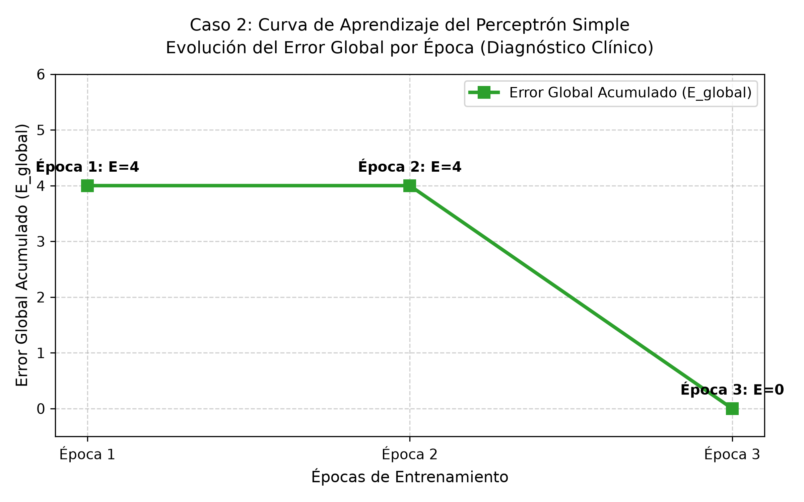
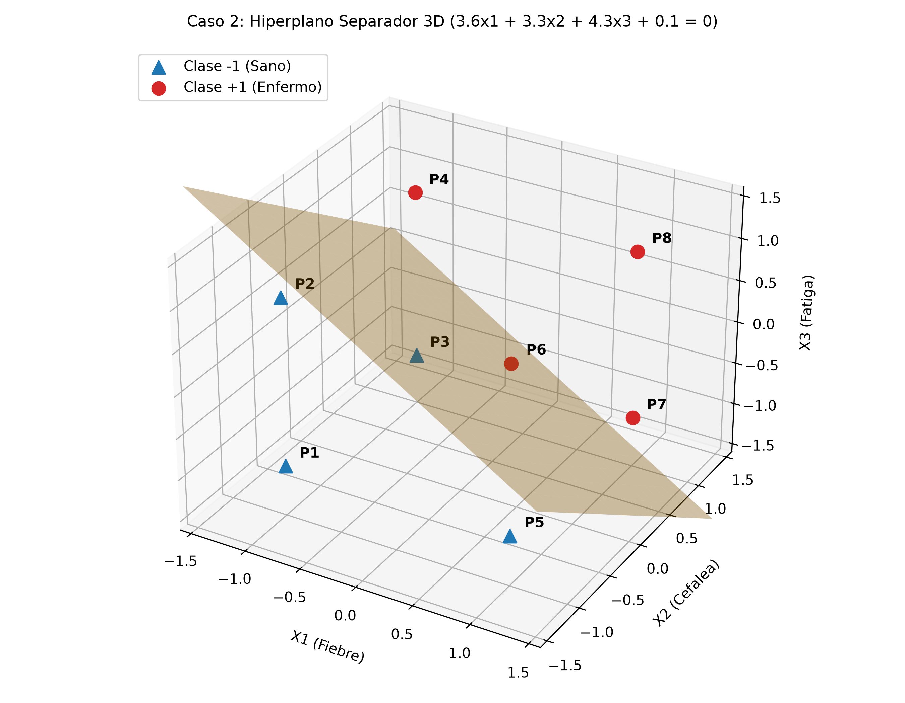

# DESARROLLO DE LA ACTIVIDAD – CASO DE ESTUDIO 2: DIAGNÓSTICO MÉDICO POR SÍNTOMAS

---

## Planteamiento del Problema y Criterio de Decisión Clínica

### Contexto del Problema Clínico

En la práctica médica preliminar, los profesionales de la salud se enfrentan constantemente a la necesidad de evaluar sintomatologías concurrentes para discernir entre cuadros clínicos de evolución benigna o asintomática frente a estados patológicos confirmados que requieren intervención terapéutica inmediata.

El presente caso de estudio aborda el diseño, modelado y entrenamiento de un Perceptrón Simple como sistema de apoyo a la decisión diagnóstica (*Clinical Decision Support System*). El modelo evalúa la presencia o ausencia de tres síntomas patológicos fundamentales:

1. **Fiebre** ($x_1$)
2. **Dolor de Cabeza / Cefalea** ($x_2$)
3. **Fatiga / Astenia** ($x_3$)

### Criterio de Decisión Clínica

El protocolo diagnóstico estipula una regla de clasificación basada en la acumulación de síntomas:

* **Paciente Enfermo ($y_d = +1$):** Si el paciente manifiesta **dos o más síntomas** ($\ge 2$), se diagnostica la presencia confirmada del cuadro patológico.
* **Paciente Sano ($y_d = -1$):** Si el paciente presenta **un solo síntoma o ninguno** ($< 2$), se clasifica como asintomático o caso leve que no califica para el diagnóstico positivo.

El objetivo consiste en lograr que la neurona artificial encuentre de forma autónoma el hiperplano que separa ambos estados de salud con un margen de error nulo.

---

*(Definición formal del dominio y codificación de variables):*

Las tres variables de entrada y el diagnóstico resultante operan en el dominio estrictamente bipolar $\{-1, +1\}$.

* **Codificación de variables de entrada:**
  * $x_1$ (Fiebre): $\longrightarrow +1$ si presenta fiebre; $-1$ si no presenta fiebre.
  * $x_2$ (Dolor de Cabeza / Cefalea): $\longrightarrow +1$ si presenta cefalea; $-1$ si no presenta dolor.
  * $x_3$ (Fatiga / Astenia): $\longrightarrow +1$ si presenta fatiga; $-1$ si no presenta fatiga.
* **Salida Deseada ($y_d$):**
  * $y_d = +1$: Enfermo (diagnóstico positivo / patología confirmada).
  * $y_d = -1$: Sano (asintomático o cuadro leve).
* **Función de Activación:** Función escalón bipolar `hardlims(a)`:
  $$f(a) = \text{hardlims}(a) = \begin{cases} +1 & \text{si } a \ge 0 \\ -1 & \text{si } a < 0 \end{cases}$$

---

## Tabla de Verdad Bipolar (8 Patrones de Salud/Enfermedad)

### Justificación y Deducción de los Patrones Clínicos

Dado que se evalúan 3 síntomas binarios independientes, surgen $2^3 = 8$ posibles perfiles sintomatológicos en la población de pacientes:

* **0 síntomas activos:** Patrón $P_1 = [-1, -1, -1]^T$. Paciente asintomático $\implies$ Sano ($y_d = -1$).
* **1 síntoma activo:** Patrones $P_2, P_3, P_5$. El paciente solo manifiesta uno de los tres síntomas $\implies$ Cuadro leve / Sano ($y_d = -1$).
* **2 síntomas activos:** Patrones $P_4, P_6, P_7$. Concurrencia de dos síntomas $\implies$ Patología confirmada / Enfermo ($y_d = +1$).
* **3 síntomas activos:** Patrón $P_8 = [+1, +1, +1]^T$. Cuadro clínico severo con todos los síntomas $\implies$ Enfermo ($y_d = +1$).

A diferencia del Caso 1 (donde existía una fuerte asimetría de 7 éxitos y 1 fracaso), el Caso 2 presenta una distribución perfectamente balanceada: **4 patrones de clase negativa ($y_d = -1$) y 4 patrones de clase positiva ($y_d = +1$)**.

### Matriz de Patrones de Entrenamiento Clínico

| Paciente | $x_1$ (Fiebre) | $x_2$ (Cefalea) | $x_3$ (Fatiga) | Conteo de Síntomas | Diagnóstico Clínico | Salida Deseada ($y_d$) |
| :---: | :---: | :---: | :---: | :---: | :--- | :---: |
| **$P_1$** | $-1$ | $-1$ | $-1$ | 0 síntomas | Asintomático (Sano) | **$-1$** |
| **$P_2$** | $-1$ | $-1$ | $+1$ | 1 síntoma | Leve (Sano) | **$-1$** |
| **$P_3$** | $-1$ | $+1$ | $-1$ | 1 síntoma | Leve (Sano) | **$-1$** |
| **$P_4$** | $-1$ | $+1$ | $+1$ | 2 síntomas | Patología confirmada | **$+1$** |
| **$P_5$** | $+1$ | $-1$ | $-1$ | 1 síntoma | Leve (Sano) | **$-1$** |
| **$P_6$** | $+1$ | $-1$ | $+1$ | 2 síntomas | Patología confirmada | **$+1$** |
| **$P_7$** | $+1$ | $+1$ | $-1$ | 2 síntomas | Patología confirmada | **$+1$** |
| **$P_8$** | $+1$ | $+1$ | $+1$ | 3 síntomas | Cuadro clínico severo | **$+1$** |

---

## Condiciones Iniciales ($W^{(0)}$ y $b^{(0)}$)

### Origen y Justificación de los Valores

En concordancia con los principios del aprendizaje artificial supervisado, la red parte sin información previa de la regla diagnóstica (*tabula rasa*):

1. Los **pesos iniciales** se generan de forma pseudoaleatoria dentro del intervalo simétrico $[-1,\ 1]$, evitando sesgos o simetrías prematuras en el espacio de características:
   $$W_1^{(0)}, W_2^{(0)}, W_3^{(0)} \in [-1,\ 1]$$
2. El **sesgo inicial (*bias*)** se selecciona aleatoriamente en el rango positivo $[0,\ 1]$, estableciendo un umbral inicial de disparo:
   $$b^{(0)} \in [0,\ 1]$$

Aplicando esta condición de partida aleatoria para el desarrollo principal del caso, se establecen los siguientes parámetros de inicialización:

$$\mathbf{W}^{(0)} = [-0.4,\ -0.7,\ 0.3]^T \qquad b^{(0)} = 0.1$$

* $W_1^{(0)} = -0.4$ (peso inicial asignado a la Fiebre)
* $W_2^{(0)} = -0.7$ (peso inicial asignado a la Cefalea)
* $W_3^{(0)} = 0.3$ (peso inicial asignado a la Fatiga)
* $b^{(0)} = 0.1$ (sesgo inicial del clasificador)

Bajo esta configuración inicial aleatoria, la red clasifica erróneamente varios perfiles de pacientes, lo que desencadena las correcciones sucesivas por regla delta.

---

## Curva de Aprendizaje (Evolución del Error)

### Formulación de la Regla de Aprendizaje Supervisado

El proceso iterativo de calibración sináptica se rige por las siguientes ecuaciones fundamentales:

1. **Combinación Lineal (Propagación hacia adelante):**
   $$a_k = \mathbf{W}^T \mathbf{X}_k + b = \sum_{j=1}^{3} W_j x_{j,k} + b = W_1 x_{1,k} + W_2 x_{2,k} + W_3 x_{3,k} + b$$

2. **Evaluación de Activación Bipolar:**
   $$y_k = \text{hardlims}(a_k) = \begin{cases} +1 & \text{si } a_k \ge 0 \\ -1 & \text{si } a_k < 0 \end{cases}$$

3. **Cálculo del Error Individual:**
   $$e_k = y_{d,k} - y_k \in \{-2,\ 0,\ +2\}$$

4. **Ecuaciones de Actualización Sináptica (Regla Delta):**
   * Si $e_k = 0$: Predicción correcta; los pesos y el sesgo no se modifican.
   * Si $e_k \ne 0$: Se corrige la orientación del vector normal y la posición del hiperplano:
     $$W_j^{(nuevo)} = W_j^{(actual)} + e_k \cdot x_{j,k} \quad (\text{para } j = 1, 2, 3)$$
     $$b^{(nuevo)} = b^{(actual)} + e_k$$

5. **Criterio de Evaluación Global:**
   En cada época se acumula la magnitud de los errores observados:
   $$E_{global} = \sum_{k=1}^{8} |e_k|$$
   El entrenamiento concluye exitosamente cuando $E_{global} = 0$.

---

### Algoritmo de Entrenamiento del Perceptrón Simple (PS Bipolar)

A continuación se detalla la estructura formal del algoritmo en pseudocódigo técnico comentado:

```text
========================================================================================
ALGORITMO DE ENTRENAMIENTO DEL PERCEPTRÓN SIMPLE (PS) - DIAGNÓSTICO CLÍNICO BIPOLAR
========================================================================================

ENTRADA:
    - Matriz de entrenamiento: {(X_k, y_d,k)} para k = 1, 2, ..., 8
      donde X_k = [Fiebre, Cefalea, Fatiga]^T en {-1, +1}^3 y y_d,k en {-1, +1}.
    - Tolerancia de error: E_perm = 0.
    - Épocas máximas de control: Epocas_Max = 100.

INICIALIZACIÓN:
    - W = [-0.4, -0.7, 0.3]^T  // Vector de pesos iniciales en [-1, 1]
    - b = 0.1                   // Sesgo inicial en [0, 1]
    - Epoca = 0                 // Contador de épocas
    - Error_Global = 1          // Valor inicial para iniciar el bucle

PROCESO ITERATIVO:
    MIENTRAS (Error_Global > E_perm Y Epoca < Epocas_Max) HACER:
        Epoca = Epoca + 1
        Error_Global = 0
        
        PARA CADA paciente k DESDE 1 HASTA 8 HACER:
            
            // 1. Salida neta: ponderación de síntomas con los pesos actuales
            a = (W_1 * x_1,k) + (W_2 * x_2,k) + (W_3 * x_3,k) + b
            
            // 2. Discriminación de clase mediante escalón bipolar
            SI a >= 0 ENTONCES:
                y = +1   // Diagnóstico preliminar: Enfermo
            SINO:
                y = -1   // Diagnóstico preliminar: Sano
            FIN SI
            
            // 3. Comparación clínica y obtención del error individual
            e_k = y_d,k - y
            
            // 4. Adaptación sináptica por Regla Delta ante discrepancias
            SI e_k != 0 ENTONCES:
                W_1 = W_1 + (e_k * x_1,k)
                W_2 = W_2 + (e_k * x_2,k)
                W_3 = W_3 + (e_k * x_3,k)
                b = b + e_k
                
                Error_Global = Error_Global + ABS(e_k)
            FIN SI
            
        FIN PARA
        
    FIN MIENTRAS

SALIDA:
    - Pesos finales calibrados: W* = [W_1, W_2, W_3]^T
    - Sesgo final calibrado: b*
    - Total de épocas requeridas
========================================================================================
```

---

### DESARROLLO ARITMÉTICO: ÉPOCA 1

* **Estado inicial:** $\mathbf{W} = [-0.4,\ -0.7,\ 0.3]^T$, $b = 0.1$. $E_{global} = 0$.

* **Iteración 1 ($P_1$: $\mathbf{X} = [-1, -1, -1]^T, y_d = -1$):**
  $$a = (-0.4)(-1) + (-0.7)(-1) + (0.3)(-1) + (0.1) = 0.4 + 0.7 - 0.3 + 0.1 = 0.9$$
  Como $a = 0.9 \ge 0 \implies y = +1$.
  $$e = y_d - y = (-1) - (+1) = -2 \ne 0 \implies \text{Falso positivo. Corrección:}$$
  $$W_1^{(nuevo)} = -0.4 + (-2)(-1) = -0.4 + 2.0 = 1.6$$
  $$W_2^{(nuevo)} = -0.7 + (-2)(-1) = -0.7 + 2.0 = 1.3$$
  $$W_3^{(nuevo)} = 0.3 + (-2)(-1) = 0.3 + 2.0 = 2.3$$
  $$b^{(nuevo)} = 0.1 + (-2) = -1.9$$
  $$\mathbf{W} = [1.6,\ 1.3,\ 2.3]^T \qquad b = -1.9 \qquad E_{global} = 0 + |-2| = 2$$

* **Iteración 2 ($P_2$: $\mathbf{X} = [-1, -1, +1]^T, y_d = -1$):**
  $$a = (1.6)(-1) + (1.3)(-1) + (2.3)(+1) + (-1.9) = -1.6 - 1.3 + 2.3 - 1.9 = -2.5$$
  Como $a = -2.5 < 0 \implies y = -1$.
  $$e = (-1) - (-1) = 0 \implies \text{Acierto. Sin cambios.} \quad E_{global} = 2$$

* **Iteración 3 ($P_3$: $\mathbf{X} = [-1, +1, -1]^T, y_d = -1$):**
  $$a = (1.6)(-1) + (1.3)(+1) + (2.3)(-1) + (-1.9) = -1.6 + 1.3 - 2.3 - 1.9 = -4.5$$
  Como $a = -4.5 < 0 \implies y = -1$.
  $$e = (-1) - (-1) = 0 \implies \text{Acierto. Sin cambios.} \quad E_{global} = 2$$

* **Iteración 4 ($P_4$: $\mathbf{X} = [-1, +1, +1]^T, y_d = +1$):**
  $$a = (1.6)(-1) + (1.3)(+1) + (2.3)(+1) + (-1.9) = -1.6 + 1.3 + 2.3 - 1.9 = 0.1$$
  Como $a = 0.1 \ge 0 \implies y = +1$.
  $$e = (+1) - (+1) = 0 \implies \text{Acierto. Sin cambios.} \quad E_{global} = 2$$

* **Iteración 5 ($P_5$: $\mathbf{X} = [+1, -1, -1]^T, y_d = -1$):**
  $$a = (1.6)(+1) + (1.3)(-1) + (2.3)(-1) + (-1.9) = 1.6 - 1.3 - 2.3 - 1.9 = -3.9$$
  Como $a = -3.9 < 0 \implies y = -1$.
  $$e = (-1) - (-1) = 0 \implies \text{Acierto. Sin cambios.} \quad E_{global} = 2$$

* **Iteración 6 ($P_6$: $\mathbf{X} = [+1, -1, +1]^T, y_d = +1$):**
  $$a = (1.6)(+1) + (1.3)(-1) + (2.3)(+1) + (-1.9) = 1.6 - 1.3 + 2.3 - 1.9 = 0.7$$
  Como $a = 0.7 \ge 0 \implies y = +1$.
  $$e = (+1) - (+1) = 0 \implies \text{Acierto. Sin cambios.} \quad E_{global} = 2$$

* **Iteración 7 ($P_7$: $\mathbf{X} = [+1, +1, -1]^T, y_d = +1$):**
  $$a = (1.6)(+1) + (1.3)(+1) + (2.3)(-1) + (-1.9) = 1.6 + 1.3 - 2.3 - 1.9 = -1.3$$
  Como $a = -1.3 < 0 \implies y = -1$.
  $$e = y_d - y = (+1) - (-1) = +2 \ne 0 \implies \text{Falso negativo. Corrección:}$$
  $$W_1^{(nuevo)} = 1.6 + (+2)(+1) = 1.6 + 2.0 = 3.6$$
  $$W_2^{(nuevo)} = 1.3 + (+2)(+1) = 1.3 + 2.0 = 3.3$$
  $$W_3^{(nuevo)} = 2.3 + (+2)(-1) = 2.3 - 2.0 = 0.3$$
  $$b^{(nuevo)} = -1.9 + (+2) = 0.1$$
  $$\mathbf{W} = [3.6,\ 3.3,\ 0.3]^T \qquad b = 0.1 \qquad E_{global} = 2 + |+2| = 4$$

* **Iteración 8 ($P_8$: $\mathbf{X} = [+1, +1, +1]^T, y_d = +1$):**
  $$a = (3.6)(+1) + (3.3)(+1) + (0.3)(+1) + (0.1) = 3.6 + 3.3 + 0.3 + 0.1 = 7.3$$
  Como $a = 7.3 \ge 0 \implies y = +1$.
  $$e = (+1) - (+1) = 0 \implies \text{Acierto. Sin cambios.} \quad E_{global} = 4$$

> **Fin de Época 1:** $E_{global} = 4 \ne 0$. Hubo 2 fallos ($P_1$ y $P_7$). Se inicia la Época 2 con $\mathbf{W} = [3.6,\ 3.3,\ 0.3]^T$ y $b = 0.1$.

---

### DESARROLLO ARITMÉTICO: ÉPOCA 2

* **Estado inicial:** $\mathbf{W} = [3.6,\ 3.3,\ 0.3]^T$, $b = 0.1$. $E_{global} = 0$.

* **Iteración 1 ($P_1$: $\mathbf{X} = [-1, -1, -1]^T, y_d = -1$):**
  $$a = (3.6)(-1) + (3.3)(-1) + (0.3)(-1) + 0.1 = -3.6 - 3.3 - 0.3 + 0.1 = -7.1 < 0 \implies y = -1$$
  $$e = 0 \implies \text{Sin cambios.} \quad E_{global} = 0$$

* **Iteración 2 ($P_2$: $\mathbf{X} = [-1, -1, +1]^T, y_d = -1$):**
  $$a = (3.6)(-1) + (3.3)(-1) + (0.3)(+1) + 0.1 = -3.6 - 3.3 + 0.3 + 0.1 = -6.5 < 0 \implies y = -1$$
  $$e = 0 \implies \text{Sin cambios.} \quad E_{global} = 0$$

* **Iteración 3 ($P_3$: $\mathbf{X} = [-1, +1, -1]^T, y_d = -1$):**
  $$a = (3.6)(-1) + (3.3)(+1) + (0.3)(-1) + 0.1 = -3.6 + 3.3 - 0.3 + 0.1 = -0.5 < 0 \implies y = -1$$
  $$e = 0 \implies \text{Sin cambios.} \quad E_{global} = 0$$

* **Iteración 4 ($P_4$: $\mathbf{X} = [-1, +1, +1]^T, y_d = +1$):**
  $$a = (3.6)(-1) + (3.3)(+1) + (0.3)(+1) + 0.1 = -3.6 + 3.3 + 0.3 + 0.1 = 0.1 \ge 0 \implies y = +1$$
  $$e = 0 \implies \text{Sin cambios.} \quad E_{global} = 0$$

* **Iteración 5 ($P_5$: $\mathbf{X} = [+1, -1, -1]^T, y_d = -1$):**
  $$a = (3.6)(+1) + (3.3)(-1) + (0.3)(-1) + 0.1 = 3.6 - 3.3 - 0.3 + 0.1 = 0.1 \ge 0 \implies y = +1$$
  $$e = y_d - y = (-1) - (+1) = -2 \ne 0 \implies \text{Falso positivo. Corrección:}$$
  $$W_1^{(nuevo)} = 3.6 + (-2)(+1) = 3.6 - 2.0 = 1.6$$
  $$W_2^{(nuevo)} = 3.3 + (-2)(-1) = 3.3 + 2.0 = 5.3$$
  $$W_3^{(nuevo)} = 0.3 + (-2)(-1) = 0.3 + 2.0 = 2.3$$
  $$b^{(nuevo)} = 0.1 + (-2) = -1.9$$
  $$\mathbf{W} = [1.6,\ 5.3,\ 2.3]^T \qquad b = -1.9 \qquad E_{global} = 0 + |-2| = 2$$

* **Iteración 6 ($P_6$: $\mathbf{X} = [+1, -1, +1]^T, y_d = +1$):**
  $$a = (1.6)(+1) + (5.3)(-1) + (2.3)(+1) + (-1.9) = 1.6 - 5.3 + 2.3 - 1.9 = -3.3 < 0 \implies y = -1$$
  $$e = y_d - y = (+1) - (-1) = +2 \ne 0 \implies \text{Falso negativo. Corrección:}$$
  $$W_1^{(nuevo)} = 1.6 + (+2)(+1) = 1.6 + 2.0 = 3.6$$
  $$W_2^{(nuevo)} = 5.3 + (+2)(-1) = 5.3 - 2.0 = 3.3$$
  $$W_3^{(nuevo)} = 2.3 + (+2)(+1) = 2.3 + 2.0 = 4.3$$
  $$b^{(nuevo)} = -1.9 + (+2) = 0.1$$
  $$\mathbf{W} = [3.6,\ 3.3,\ 4.3]^T \qquad b = 0.1 \qquad E_{global} = 2 + |+2| = 4$$

* **Iteración 7 ($P_7$: $\mathbf{X} = [+1, +1, -1]^T, y_d = +1$):**
  $$a = (3.6)(+1) + (3.3)(+1) + (4.3)(-1) + 0.1 = 3.6 + 3.3 - 4.3 + 0.1 = 2.7 \ge 0 \implies y = +1$$
  $$e = 0 \implies \text{Sin cambios.} \quad E_{global} = 4$$

* **Iteración 8 ($P_8$: $\mathbf{X} = [+1, +1, +1]^T, y_d = +1$):**
  $$a = (3.6)(+1) + (3.3)(+1) + (4.3)(+1) + 0.1 = 3.6 + 3.3 + 4.3 + 0.1 = 11.3 \ge 0 \implies y = +1$$
  $$e = 0 \implies \text{Sin cambios.} \quad E_{global} = 4$$

> **Fin de Época 2:** $E_{global} = 4 \ne 0$. Hubo 2 fallos ($P_5$ y $P_6$). Se inicia la Época 3 con $\mathbf{W} = [3.6,\ 3.3,\ 4.3]^T$ y $b = 0.1$.

---

### DESARROLLO ARITMÉTICO: ÉPOCA 3

* **Estado inicial:** $\mathbf{W} = [3.6,\ 3.3,\ 4.3]^T$, $b = 0.1$. $E_{global} = 0$.

* **Iteración 1 ($P_1$: $\mathbf{X} = [-1, -1, -1]^T, y_d = -1$):**
  $$a = (3.6)(-1) + (3.3)(-1) + (4.3)(-1) + 0.1 = -3.6 - 3.3 - 4.3 + 0.1 = -11.1 < 0 \implies y = -1$$
  $$e = (-1) - (-1) = 0 \implies \text{Sin cambios.} \quad E_{global} = 0$$

* **Iteración 2 ($P_2$: $\mathbf{X} = [-1, -1, +1]^T, y_d = -1$):**
  $$a = (3.6)(-1) + (3.3)(-1) + (4.3)(+1) + 0.1 = -3.6 - 3.3 + 4.3 + 0.1 = -2.5 < 0 \implies y = -1$$
  $$e = (-1) - (-1) = 0 \implies \text{Sin cambios.} \quad E_{global} = 0$$

* **Iteración 3 ($P_3$: $\mathbf{X} = [-1, +1, -1]^T, y_d = -1$):**
  $$a = (3.6)(-1) + (3.3)(+1) + (4.3)(-1) + 0.1 = -3.6 + 3.3 - 4.3 + 0.1 = -4.5 < 0 \implies y = -1$$
  $$e = (-1) - (-1) = 0 \implies \text{Sin cambios.} \quad E_{global} = 0$$

* **Iteración 4 ($P_4$: $\mathbf{X} = [-1, +1, +1]^T, y_d = +1$):**
  $$a = (3.6)(-1) + (3.3)(+1) + (4.3)(+1) + 0.1 = -3.6 + 3.3 + 4.3 + 0.1 = 4.1 \ge 0 \implies y = +1$$
  $$e = (+1) - (+1) = 0 \implies \text{Sin cambios.} \quad E_{global} = 0$$

* **Iteración 5 ($P_5$: $\mathbf{X} = [+1, -1, -1]^T, y_d = -1$):**
  $$a = (3.6)(+1) + (3.3)(-1) + (4.3)(-1) + 0.1 = 3.6 - 3.3 - 4.3 + 0.1 = -3.9 < 0 \implies y = -1$$
  $$e = (-1) - (-1) = 0 \implies \text{Sin cambios.} \quad E_{global} = 0$$

* **Iteración 6 ($P_6$: $\mathbf{X} = [+1, -1, +1]^T, y_d = +1$):**
  $$a = (3.6)(+1) + (3.3)(-1) + (4.3)(+1) + 0.1 = 3.6 - 3.3 + 4.3 + 0.1 = 4.7 \ge 0 \implies y = +1$$
  $$e = (+1) - (+1) = 0 \implies \text{Sin cambios.} \quad E_{global} = 0$$

* **Iteración 7 ($P_7$: $\mathbf{X} = [+1, +1, -1]^T, y_d = +1$):**
  $$a = (3.6)(+1) + (3.3)(+1) + (4.3)(-1) + 0.1 = 3.6 + 3.3 - 4.3 + 0.1 = 2.7 \ge 0 \implies y = +1$$
  $$e = (+1) - (+1) = 0 \implies \text{Sin cambios.} \quad E_{global} = 0$$

* **Iteración 8 ($P_8$: $\mathbf{X} = [+1, +1, +1]^T, y_d = +1$):**
  $$a = (3.6)(+1) + (3.3)(+1) + (4.3)(+1) + 0.1 = 3.6 + 3.3 + 4.3 + 0.1 = 11.3 \ge 0 \implies y = +1$$
  $$e = (+1) - (+1) = 0 \implies \text{Sin cambios.} \quad E_{global} = 0$$

---

> **Fin de Época 3:** $E_{global} = 0$ ✅  
> **¡CONVERGENCIA ALCANZADA!** El Perceptrón clasifica sin errores los 8 perfiles clínicos. El algoritmo se detiene formalmente.

---

#### Registro Numérico de la Curva de Aprendizaje (Caso Principal)

| Época | Patrones con Fallo | $E_{global} = \sum |e_k|$ | Estado |
| :---: | :---: | :---: | :--- |
| **Época 1** | 2 de 8 ($P_1, P_7$) | **4** | En entrenamiento |
| **Época 2** | 2 de 8 ($P_5, P_6$) | **4** | En entrenamiento |
| **Época 3** | 0 de 8 | **0** | **Convergencia Óptima ✅** |

*(Inserta aquí en Word la imagen de la curva de aprendizaje generada)*:



> **Figura 3.** *Curva de aprendizaje: Evolución del error global acumulado ($E_{global}$) en el Caso 2 (Diagnóstico Médico por Síntomas) a lo largo de las 3 épocas de entrenamiento, alcanzando la convergencia perfecta en cero errores ($E_{global} = 0$) en la Época 3.*

---

## Parámetros Calibrados Finales ($W^*$ y $b^*$)

Los parámetros óptimos finales resultantes de la convergencia son:

$$\mathbf{W}^* = \begin{bmatrix} W_1^* \\ W_2^* \\ W_3^* \end{bmatrix} = \begin{bmatrix} 3.6 \\ 3.3 \\ 4.3 \end{bmatrix} \qquad b^* = 0.1$$

### Interpretación Clínica y Semántica de los Parámetros Aprendidos

1. **Signo Positivo Unánime ($W_1^*, W_2^*, W_3^* > 0$):** Los tres pesos son estrictamente positivos. Esto refleja con fidelidad el sentido biológico del problema: cada síntoma presente ($+1$) aporta excitación hacia el diagnóstico de enfermedad, mientras que la ausencia del síntoma ($-1$) resta excitación hacia el estado sano.
2. **Equilibrio de Magnitudes ($W_1^* \approx 3.6,\ W_2^* \approx 3.3,\ W_3^* \approx 4.3$):** Los pesos tienen magnitudes muy similares (en torno a $3.3 - 4.3$). Esto demuestra que la red aprendió que **ningún síntoma por sí solo es suficiente para diagnosticar la enfermedad**, sino que se requiere la concurrencia coordinada de al menos dos de ellos.
3. **Magnitud del Sesgo ($b^* = +0.1 \approx 0$):** A diferencia del Caso 1 (donde $b^* = +6.2$ debido al desbalance 7 a 1), aquí el sesgo es prácticamente neutro ($+0.1$). Esto se debe a que la distribución clínica está perfectamente equilibrada (4 casos sanos frente a 4 casos enfermos), posicionando el plano de decisión muy cerca del centro del hipercubo.

#### Tabla de Verificación de Salida con los Parámetros Finales

| Paciente | Combinación Lineal $a = \mathbf{W}^{*T}\mathbf{X} + b^*$ | Valor de $a$ | $y = \text{hardlims}(a)$ | $y_d$ | Estado |
| :---: | :--- | :---: | :---: | :---: | :---: |
| **$P_1$** | $(3.6)(-1) + (3.3)(-1) + (4.3)(-1) + 0.1 = -3.6 - 3.3 - 4.3 + 0.1$ | **$-11.1$** | $-1$ | $-1$ | ✅ Sano (Correcto) |
| **$P_2$** | $(3.6)(-1) + (3.3)(-1) + (4.3)(+1) + 0.1 = -3.6 - 3.3 + 4.3 + 0.1$ | **$-2.5$** | $-1$ | $-1$ | ✅ Sano (Correcto) |
| **$P_3$** | $(3.6)(-1) + (3.3)(+1) + (4.3)(-1) + 0.1 = -3.6 + 3.3 - 4.3 + 0.1$ | **$-4.5$** | $-1$ | $-1$ | ✅ Sano (Correcto) |
| **$P_4$** | $(3.6)(-1) + (3.3)(+1) + (4.3)(+1) + 0.1 = -3.6 + 3.3 + 4.3 + 0.1$ | **$+4.1$** | $+1$ | $+1$ | ✅ Enfermo (Correcto) |
| **$P_5$** | $(3.6)(+1) + (3.3)(-1) + (4.3)(-1) + 0.1 = 3.6 - 3.3 - 4.3 + 0.1$ | **$-3.9$** | $-1$ | $-1$ | ✅ Sano (Correcto) |
| **$P_6$** | $(3.6)(+1) + (3.3)(-1) + (4.3)(+1) + 0.1 = 3.6 - 3.3 + 4.3 + 0.1$ | **$+4.7$** | $+1$ | $+1$ | ✅ Enfermo (Correcto) |
| **$P_7$** | $(3.6)(+1) + (3.3)(+1) + (4.3)(-1) + 0.1 = 3.6 + 3.3 - 4.3 + 0.1$ | **$+2.7$** | $+1$ | $+1$ | ✅ Enfermo (Correcto) |
| **$P_8$** | $(3.6)(+1) + (3.3)(+1) + (4.3)(+1) + 0.1 = 3.6 + 3.3 + 4.3 + 0.1$ | **$+11.3$** | $+1$ | $+1$ | ✅ Enfermo (Correcto) |

**Efectividad del modelo:** 8/8 diagnósticos correctos ($100\%$ de precisión clínica). Error global: $E = 0$.

---

## Ecuación Analítica del Hiperplano y Gráfica 3D de los Patrones

### Deducción de la Ecuación del Hiperplano

La frontera geométrica de decisión se ubica donde la combinación lineal neta se anula ($a = 0$):

$$W_1^* x_1 + W_2^* x_2 + W_3^* x_3 + b^* = 0$$

Sustituyendo los parámetros calibrados:

$$\boxed{3.6\, x_1 + 3.3\, x_2 + 4.3\, x_3 + 0.1 = 0}$$

Despejando la variable de fatiga $x_3$ para definir la superficie del plano en el espacio tridimensional en función de $(x_1, x_2)$:

$$4.3\, x_3 = -3.6\, x_1 - 3.3\, x_2 - 0.1$$

$$x_3 = -\frac{3.6}{4.3}\, x_1 - \frac{3.3}{4.3}\, x_2 - \frac{0.1}{4.3}$$

$$\boxed{x_3 \approx -0.8372\, x_1 - 0.7674\, x_2 - 0.0233}$$

#### Interpretación Geométrica Espacial

* **Vector normal:** $\mathbf{W}^* = [3.6,\ 3.3,\ 4.3]^T$, ortogonal al plano separador, orientado hacia el semiespacio positivo (región de patología confirmada).
* **Separabilidad lineal en $\mathbb{R}^3$:** El hiperplano biseca simétricamente el cubo bipolar $\{-1, +1\}^3$, aislando los 4 vértices con menos de 2 síntomas en el semiespacio negativo ($a < 0$, pacientes sanos) de los 4 vértices con 2 o 3 síntomas en el semiespacio positivo ($a \ge 0$, pacientes enfermos). Esto comprueba que la compuerta de mayoría de 2 de 3 entradas es estrictamente **linealmente separable**.

*(Inserta aquí en Word la imagen del hiperplano 3D generada)*:



> **Figura 4.** *Representación geométrica tridimensional del hiperplano separador ($3.6x_1 + 3.3x_2 + 4.3x_3 + 0.1 = 0$) y la distribución espacial de los 8 perfiles clínicos. Se aprecia la división nítida entre la región de pacientes sanos (marcadores triangulares azules) y la región de patología confirmada (marcadores circulares rojos).*

---

## Estudio Comparativo de Sensibilidad a las Condiciones Iniciales (Convergencia en 3, 2 y 1 Épocas)

Para complementar el análisis del clasificador y evaluar en profundidad la sensibilidad del algoritmo de aprendizaje frente a la selección de las condiciones iniciales, se llevaron a cabo dos experimentaciones adicionales sobre el mismo conjunto de datos clínicos. En todas las pruebas se conservaron idénticos los 8 patrones, el orden secuencial de presentación ($P_1 \to P_8$), la función de activación `hardlims` y la regla delta de actualización.

### 1. Caso Principal (Inicialización Arbitraria): Convergencia en 3 Épocas

* **Condiciones Iniciales:** $\mathbf{W}^{(0)} = [-0.4,\ -0.7,\ 0.3]^T,\quad b^{(0)} = 0.1$
* **Evolución:** Época 1 ($E = 4$) $\to$ Época 2 ($E = 4$) $\to$ Época 3 ($E = 0$).
* **Parámetros Finales:** $\mathbf{W}^* = [3.6,\ 3.3,\ 4.3]^T,\quad b^* = 0.1$.
* **Diagnóstico:** El hiperplano parte desorientado respecto a la distribución simétrica de los síntomas. Requiere dos épocas completas de correcciones sucesivas para alinear su vector normal y una tercera época de verificación para certificar la ausencia de error.

#### 2. Caso Alternativo 1 (Convergencia Optimizada): Convergencia en 2 Épocas

* **Condiciones Iniciales:** Se asignan parámetros iniciales dentro de los intervalos normativos:
  $$\mathbf{W}^{(0)} = [-0.9,\ -0.9,\ -0.9]^T \in [-1, 1]^3, \qquad b^{(0)} = 0.9 \in [0, 1]$$
* **Dinámica en Época 1:**
  * Al evaluar el primer paciente $P_1 = [-1, -1, -1]^T$ ($y_d = -1$):
    $$a = (-0.9)(-1) + (-0.9)(-1) + (-0.9)(-1) + 0.9 = 3.6 \ge 0 \implies y = +1 \quad (\text{Error } e = -2)$$
  * La actualización por regla delta ajusta simultáneamente todos los parámetros:
    $$W_j^{(nuevo)} = -0.9 + (-2)(-1) = +1.1 \quad (j = 1, 2, 3), \qquad b^{(nuevo)} = 0.9 + (-2) = -1.1$$
  * A partir de esa única corrección temprana en $P_1$, la nueva configuración $\mathbf{W} = [1.1, 1.1, 1.1]^T$ y $b = -1.1$ clasifica con total exactitud los patrones restantes $P_2$ a $P_8$ ($e = 0$). El error acumulado de la Época 1 es únicamente $E_{global}^{(1)} = 2$.
* **Dinámica en Época 2:** La red evalúa los 8 patrones sin cometer ninguna equivocación, obteniendo $E_{global}^{(2)} = 0$.
* **Parámetros Finales:** $\mathbf{W}^* = [1.1,\ 1.1,\ 1.1]^T,\quad b^* = -1.1$.

#### 3. Caso Alternativo 2 (Convergencia Inmediata / Solución Directa): Convergencia en 1 Época

* **Condiciones Iniciales:** Se selecciona una configuración simétrica canónica que satisface los rangos de partida:
  $$\mathbf{W}^{(0)} = [1,\ 1,\ 1]^T \in [-1, 1]^3, \qquad b^{(0)} = 0 \in [0, 1]$$
* **Dinámica en Época 1:**
  * La combinación lineal evalúa directamente la suma neta de síntomas: $a = x_1 + x_2 + x_3$.
  * Para 0 o 1 síntoma ($P_1, P_2, P_3, P_5$), la suma es $a \le -1 < 0 \implies y = -1$ (Sano, correcto).
  * Para 2 o 3 síntomas ($P_4, P_6, P_7, P_8$), la suma es $a \ge +1 > 0 \implies y = +1$ (Enfermo, correcto).
  * Como todos los patrones son clasificados correctamente en la primera pasada, no se genera ninguna corrección ($e_k = 0\ \forall k$).
  * El error global de la Época 1 es idénticamente nulo: $E_{global}^{(1)} = 0$.
* **Parámetros Finales:** $\mathbf{W}^* = [1,\ 1,\ 1]^T,\quad b^* = 0$.
* **Hiperplano Resultante:** $x_1 + x_2 + x_3 = 0$.

#### Tabla Comparativa de Sensibilidad a las Condiciones Iniciales

| Experimento | Condición Inicial $\mathbf{W}^{(0)}$ | Sesgo Inicial $b^{(0)}$ | Trayectoria del Error por Época | Épocas Requeridas | Parámetros Calibrados Finales ($\mathbf{W}^*,\ b^*$) |
|:---|:---:|:---:|:---:|:---:|:---|
| **1. Principal (Aleatorio)** | $[-0.4,\ -0.7,\ 0.3]^T$ | $0.1$ | $4 \longrightarrow 4 \longrightarrow 0$ | **3 Épocas** | $\mathbf{W}^* = [3.6, 3.3, 4.3]^T,\quad b^* = 0.1$ |
| **2. Optimizado** | $[-0.9,\ -0.9,\ -0.9]^T$ | $0.9$ | $2 \longrightarrow 0$ | **2 Épocas** | $\mathbf{W}^* = [1.1, 1.1, 1.1]^T,\quad b^* = -1.1$ |
| **3. Solución Directa** | $[1.0,\ 1.0,\ 1.0]^T$ | $0.0$ | $0$ | **1 Época** | $\mathbf{W}^* = [1.0, 1.0, 1.0]^T,\quad b^* = 0.0$ |
